### Iterator
remove odd elements from arraylist
https://www.geeksforgeeks.org/java/iterators-in-java/


### Maximum Depth or Height of a Binary Tree
https://www.geeksforgeeks.org/dsa/find-the-maximum-depth-or-height-of-a-tree/
给定二叉树的根节点，求该树的最大深度。树的最大深度或高度是指从根节点到最深节点的边的数量。
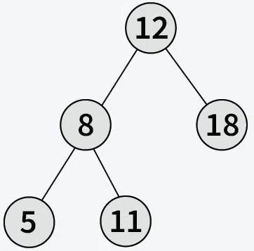

输出： 2
说明：从根节点到最深节点的最长路径有 2 条边。

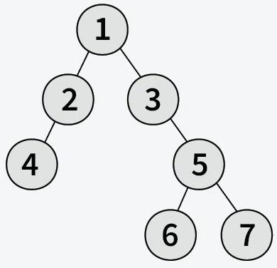

输出： 3
说明：从根节点（节点 1）到最深叶节点（节点 6）的最长路径有 3 条边。
### Tree Traversal

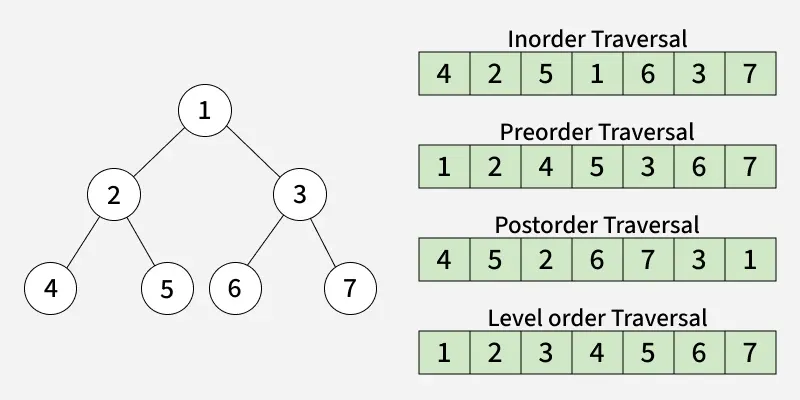
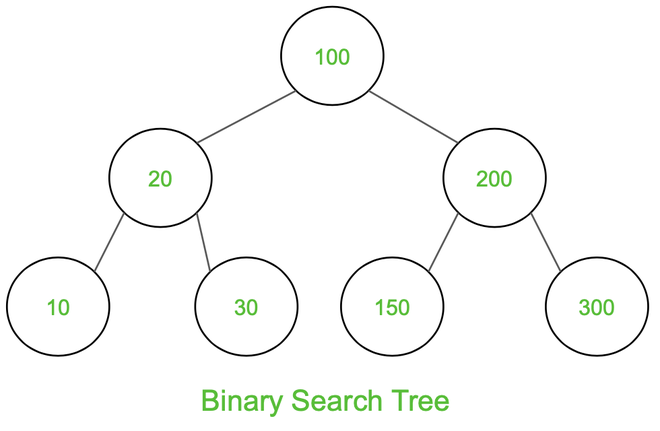
Output:
* Inorder Traversal: 10 20 30 100 150 200 300
* Preorder Traversal: 100 20 10 30 200 150 300
* Postorder Traversal: 10 30 20 150 300 200 100


### Binary Search Tree
https://www.geeksforgeeks.org/java/java-program-to-construct-a-binary-search-tree/
二叉搜索树（BST）是计算机科学中广泛使用的数据结构，主要以其高效的搜索、插入和删除操作而闻名。它是一种特殊的二叉树，其中每个节点最多有两个子节点，分别称为左子节点和右子节点。二叉搜索树在搜索、插入和删除等操作的平均时间复杂度为O(log n)，使其非常适合需要快速搜索的应用。

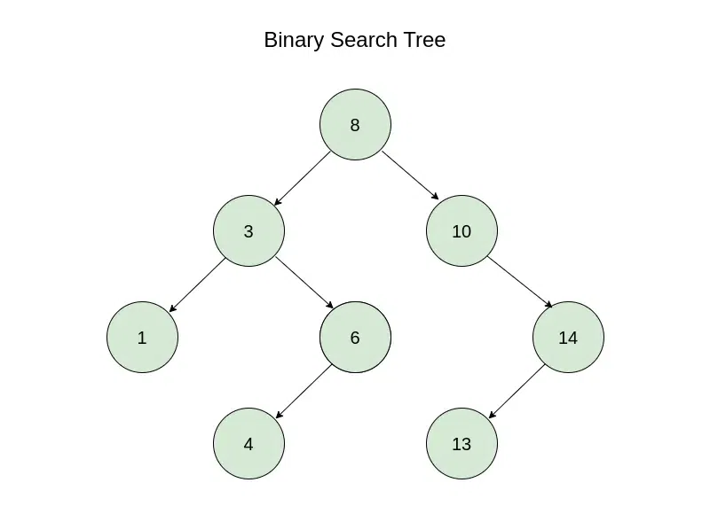

图片说明：

这棵树的根节点是 8。
根的左子树包含小于根值的键，即 1、3、6、4。
根的右子树包含大于根值的键，即 10、14、13。

### Tower of Hanoi
https://www.geeksforgeeks.org/java/java-program-for-tower-of-hanoi/
汉诺塔是一个数学谜题，它由三根杆和n个圆盘组成。谜题的目标是将整个圆盘堆移动到另一根杆上，并遵守以下简单规则：1）每次只能移动一个圆盘。2）每次移动都是从一叠圆盘中取出最上面的圆盘，并将其放在另一叠圆盘的顶部，也就是说，只有位于最上面的圆盘才能被移动。3）任何圆盘都不能放在比它小的圆盘上面。
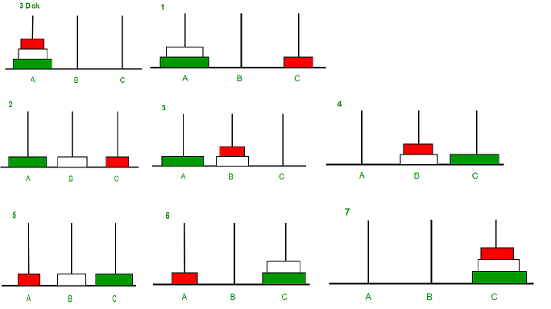

### Q1 Addition
编写一个Java类 Q1，要求：
1. 定义一个函数 add，它接受两个整数参数，返回它们的和。 
2. 在 main 方法中调用这个函数，并打印算式(3 + 5 = 8)。

### Q2 — 用户输入加法 (Addition with Input)

在 Q1 的基础上，修改程序，使其能够从用户输入读取两个整数，然后调用 add 函数进行加法运算，并打印结果。

输出格式如下：

```
请输入第一个整数: 3
请输入第二个整数: 5
3 + 5 = 8
```

### Q3 — 支持加减乘除的计算器 (Calculator with Keywords)

在 Q2 的基础上，扩展程序，支持四则运算（加、减、乘、除），通过英文指令控制操作。

要求：
1. 定义四个函数：add, subtract, multiply, divide，分别执行加减乘除运算。
2. 用户输入两个整数和一个指令（关键字），程序根据指令调用对应函数。
3. 支持的关键字：add, subtract, multiply, divide

输出结果，例如：
```
请输入第一个整数: 10
请输入第二个整数: 5
请输入操作(add, subtract, multiply, divide): divide
10 / 5 = 2
```

### Q4 动物继承练习（Animal Inheritance）

动物包括水生动物和陆生动物。它们都有名字，并可以呼吸和介绍自己。

请实现以下类继承关系：
* Animal → AquaticAnimal → Fish、Whale
* Animal → TerrestrialAnimal → Cat

要求：

1. 每个子类覆盖 breathe() 方法，输出自己的呼吸方式。
2. 创建 AnimalDemo 类，依次创建 Fish("Nemo")、Whale("Willy")、Cat("Tom")，调用 introduce() 和 breathe()

示例输出
--- Fish ---
I am Nemo
Fish Nemo breathes through gills.

--- Whale ---
I am Willy
Whale Willy breathes through lungs.

--- Cat ---
I am Tom
Cat Tom breathes through lungs.

在完成代码之前，先考虑一个问题——
在这个题目中，是否需要用到Abstract Class？

### Q5 
给定一个大小为 n 的循环链表，反转链表，使其节点顺序反转，同时保持循环特性。反转过程必须通过修改节点之间的链接来实现，而不能改变节点的值。
原始链表
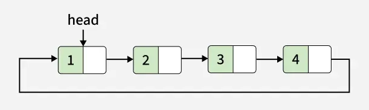
反转链表
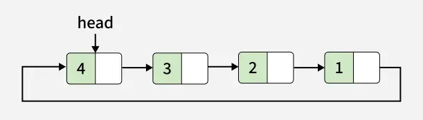

REF：https://www.geeksforgeeks.org/dsa/reverse-circular-linked-list/

### Q6
Rotate Doubly linked list by N nodes
Given a doubly-linked list, the task is to rotate the linked list counter-clockwise by p nodes. Here p is a given positive integer and is smaller than the count of nodes in the linked list.
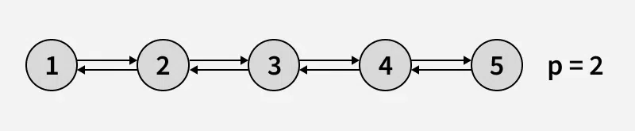
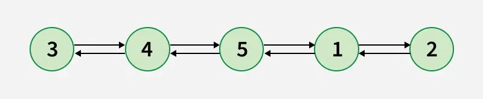

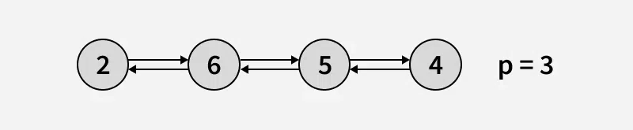
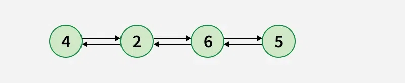

REF: https://www.geeksforgeeks.org/dsa/rotate-doubly-linked-list-n-nodes/

### Q7
Write a Java program that reads a text document and outputs the frequency of each alphabet character (‘a’–‘z’) contained in the document.


### Q8 
用递归的方法输出斐波那契数列的前n项
获取需要计算斐波那契数列的数字。

#### 思路
递归地从值 N 迭代到 1：
* 基本情况：如果递归调用的值小于 1，则函数返回 1。
* 递归调用：如果基本情况不满足，则递归调用前两个值，如下所示：
`recursive_function(N - 1) + recursive_function(N - 2);`

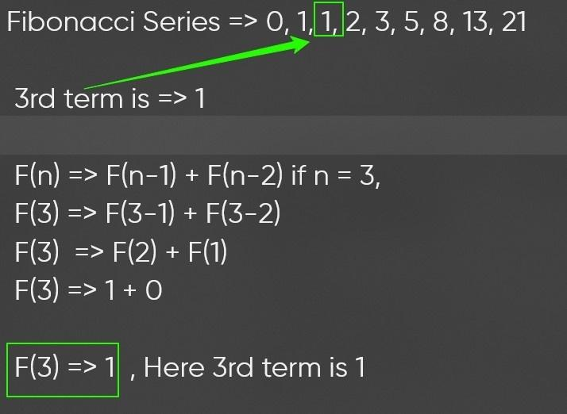
REF：https://www.geeksforgeeks.org/java/java-fibonacci-series/


### Q9
Stack: Last In First Out (LIFO)
Implement Stack using linkedlist

栈可以用链表来实现，其中我们维护：

1. 一个节点结构/类，包含：
2. 数据 → 用于存储元素。
3. 下一个 → 指向栈中下一个节点的指针/引用。
4. 指向栈顶节点的指针/引用。
5. 初始状态下，top = null 表示栈为空。
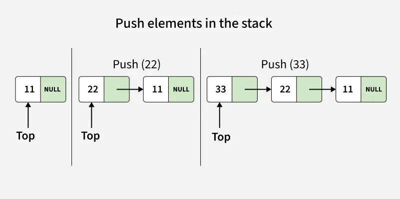
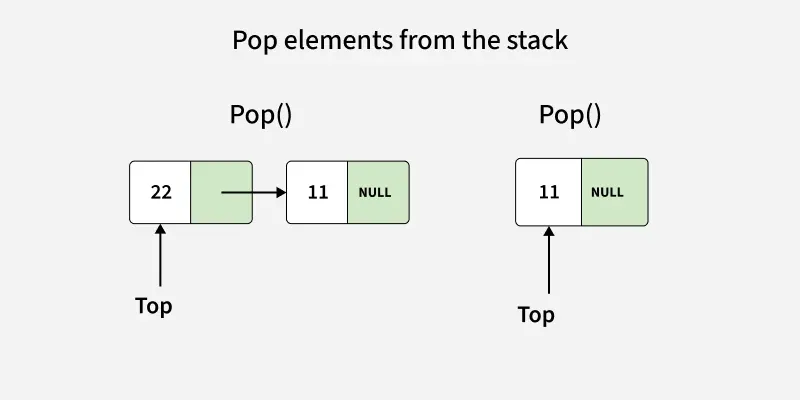

REF: https://www.geeksforgeeks.org/dsa/implement-a-stack-using-singly-linked-list/

### Q10
Queue: First-In-First-Out (FIFO)
使用链表声明队列
为了用链表实现队列，我们维护包含以下内容的节点结构/类：

* 数据 → 用于存储元素。
* next → 指向队列中下一个节点的指针/引用。
* front → 指向第一个节点（队列的头部）。
* rear → 指向最后一个节点（队列的尾部）。

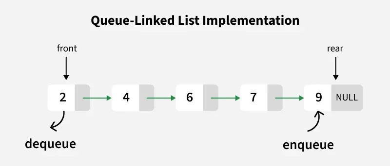

REF: https://www.geeksforgeeks.org/dsa/queue-linked-list-implementation/

